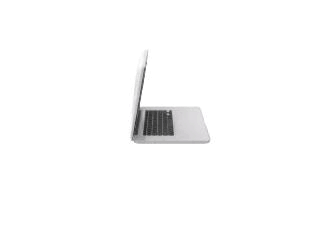
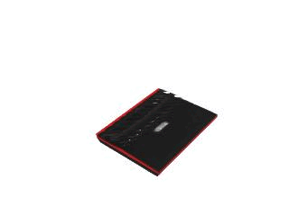
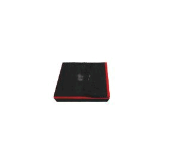
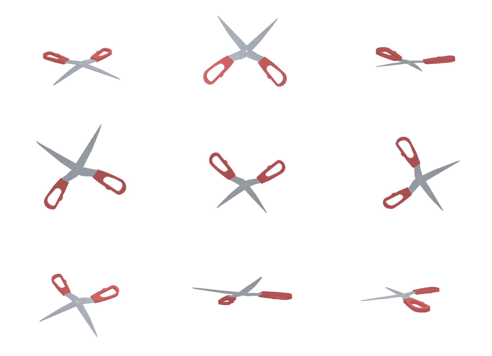

# Articulated Object Neural Radiance Field

This repository is the experimental implementation of articulated object NeRF training and rendering from some of the ideas mentioned in a few papers including [CLA-NeRF](https://arxiv.org/abs/2202.00181) and [NASAM](https://arxiv.org/abs/2205.08525).

**Goal of this repo**: To implement a simple and intuitive pipeline for training and rendering [Neural Radiance Fields](https://arxiv.org/abs/2003.08934) for articulated objects given 1. Multi-view consistent as well as articulation-aware input images of specific objects (**Overfitting**) and 2. (In pipeline) Multi-view consistent and articulation-aware input images of diverse instances of objects within a category to predict NeRFs for new instances using few images (**Generalization**)

Overall, this repo can be used as stand-alone project for creating your articulated object NeRF models and building other cool things on top of it. The project is built on top of amazing NeRF implementation of [nerf_pl](https://github.com/kwea123/nerf_pl) and [nerf-factory](https://github.com/kakaobrain/nerf-factory). Kudos to the authors for creating wonderful repos!

If you find this repository useful, please consider [citing](https://github.com/zubair-irshad/articulated-object-nerf/blob/master/README.md#-citation) and STARing🌟 the repo. Feel free to share the implementation with others!

<div style="display:flex;">
  
  
  
</div>

### Contents

- [🍀 Overview](#-overview)
- [💻 Installation](#-installation)
- [📊 Dataset](#-dataset)
- [✨ Training and Inference](#-training-and-inference)
- [📝 Citation](#-citation)

## 🍀 Overview

Experimental Repo for Modelling Neural Radiance Field for Articulated Objects. Currently supported Experiments:

- Sapien Dataset (Single Instance Overfitting)
- Sapien Dataset (Single Instance Articulated Overfitting)
- Sapien Dataset (Single Instance Auto-Encoder Articulated NeRF)

Future (In Pipeline):

- Sapien Dataset (Single Instance Auto-Decoder Articulated NeRF)
- Sapien Dataset (Generalization experiments i.e. few-shot Articulated NeRF)

## 💻 Installation

1. Hardware

* OS: Ubuntu 18.04
* NVIDIA GPU with **CUDA>=10.2** (tested with 1 RTX2080Ti)

2. Software

* Clone this repo by `git clone --recursive https://github.com/zubair-irshad/articulated-object-nerf`
* Python>=3.7 (installation via [anaconda](https://www.anaconda.com/distribution/) is recommended, use `conda create -n ao-nerf python=3.7` to create a conda environment and activate it by `conda activate aon`)
* Python libraries
  * Install core requirements by `pip install -r requirements.txt`

## 📊 Dataset

1. Download pre-generated SAPIEN Dataset: [Download link1 ](https://www.dropbox.com/scl/fi/t9wsvgnmvjjzpc555nan5/sapien_single_scene.tar.xz?rlkey=mhj1e6jc3ywbvdyl3mwtr70yw&dl=1) [Download link2](https://www.dropbox.com/scl/fi/q88wzo9gk3c1kab7suckx/sapien_single_scene_art.tar.xz?rlkey=ckmpsp8csqm7nz40rfv86w2tv&dl=1)
2. Generate Sapien Dataset
    * Data generation for NeRF training
        1. Modify the config file in ```./config/data_gen_*.json```
        2. **(optional)** If you want to save the pose for image rendering, add key-value ```"save_render_pose_path": path/to/save``` in the json file. If you want to generate images using this saved pose file, add key-value ```"render_pose_path":path/to/files```.
        3. Once you have modified your config file, just run ```python datagen/data_gen.py --config config/your_datagen_config.json```. 
        4. Data will be saved in ```output_dir/{train, val, test}```
        
    **scissor is the output_dir, and the folder tree looks like this**
   
    ```
    scissor
    ├── test
    ├── train
    │   ├── depth
    │   ├── rgb
    │   └── transforms.json
    └── val
    ```
    **The generated images looks like this**
    


    * Data generation for Articulation training
        * Coming soon!

## ✨ Training and Inference

1. Setup ``wandb`` for logging

* run ``wandb login`` in command line and enter your wandb key to setup

2. Training

* Single Instance Overfitting training

Note that the ```--root_dir``` shall be the same as the ```--output_dir``` specified in data generation.

```
python run.py --dataset_name sapien --root_dir /experiments/zubair/datasets/sapien_single_scene --exp_name sapien_single_scene_vanilla --exp_type vanilla --img_wh 640 480 --white_back --batch_size 1 --num_gpus 8  --num_epochs 100
```

**Alternatively**

You can wirte all those args in the json config file as key-value pair, check ```config/nerf_training.json``` for example. Once you have modified your config file, run: ```python run.py --config config/nerf_training.json```.

Same for evaluation(test).

* Single Instance Articulated Overfitting

```
CUDA_VISIBLE_DEVICES=0,2,3,4,5,6,7 python run.py --dataset_name sapien_multi --root_dir /experiments/zubair/datasets/sapien_single_scene_art --exp_name sapien_single_scene_articulated --exp_type vanilla_autodecoder --img_wh 320 240 --white_back --batch_size 1 --num_gpus 7
```

3. Evaluation

* Single Scene Overfitting:

```
CUDA_VISIBLE_DEVICES=0 python run.py --dataset_name sapien --root_dir /experiments/zubair/datasets/sapien_single_scene --exp_name sapien_single_scene_vanilla --exp_type vanilla --img_wh 640 480 --white_back --batch_size 1 --num_gpus 1 --run_eval --render_name sapien_test_highres
```

* Single Insatnce Articulation Overfitting

```
CUDA_VISIBLE_DEVICES=0 python /home/ubuntu/zubair/articulated-object-nerf/run.py --dataset_name sapien_multi --root_dir /experiments/zubair/datasets/sapien_single_scene_art --exp_name sapien_single_scene_articulated --exp_type vanilla_autodecoder --img_wh 320 240 --white_back --batch_size 1 --N_max_objs 1 --run_eval --render_name single_image_train_degs_interpolation2
```

---

## 📝 Citation

If you find this repository useful, please consider citing this implementation as well as the two original papers:

```
@misc{irshad2023articulatednerf,
    title = {Articulated Object NeRF - A simple and intuitive implementation of creating articulated object neural radiance fields},
    author = {Muhammad Zubair Irshad},
    journal = {GitHub repository},
    url = {https://github.com/zubair-irshad/articulated-object-nerf},
    year = {2023},
}
```

```
@inproceedings{tseng2022clanerf,
      title={CLA-NeRF: Category-Level Articulated Neural Radiance Field}, 
      author={Wei-Cheng Tseng and Hung-Ju Liao and Yen-Chen Lin and Min Sun},
      booktitle={ICRA},
      year={2022},
}

@inproceedings{wei2022nasam,
    title = {Self-supervised Neural Articulated Shape and Appearance Models},
    author = {Fangyin Wei and Rohan Chabra and Lingni Ma and Christoph
              Lassner and Michael Zollhoefer and Szymon Rusinkiewicz and Chris
              Sweeney and Richard Newcombe and Mira Slavcheva},
    booktitle = {Proceedings IEEE/CVF Conference on Computer Vision and Pattern Recognition (CVPR)},
    year={2022}
}
```
